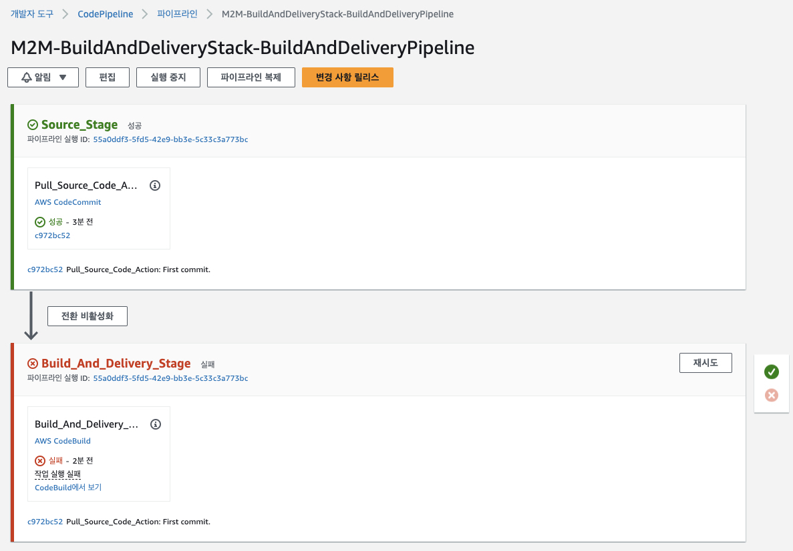

# TravelBuddy 컨테이너화하기
앞서 우리가 CDK를 배포한 자원에는 EKS 클러스터와 더불어 빌드 및 전달 (Build and Delivery) 파이프라인도 포함되어 있습니다.

우리는 이 파이프라인을 통해 TravelBuddy를 빌드하고 컨테이너화 (Containerize)하여 AWS의 컨테이너 레지스트리 서비스인 ECR (Elastic Container Registry)의 리포지터리로 전달할 예정입니다.

TravelBuddy 어플리케이션은 이미 Java와 Maven을 빌드 체계를 제공하므로, 우리는 애플리케이션을 빌드하는 새로운 Scheme을 구성하는 대신 기존의 빌드 툴인 Maven을 이용하면서 컨테이너화 하는 것에만 집중하여 실습을 진행합니다.

## Agenda
- 준비하기
- TravelBuddy 프로젝트 살펴보기
- 바이너리 및 컨테이너 이미지 빌드하기
- ECR에 이미지 푸시하기

## 준비하기
1. 먼저 어플리케이션의 소스 리포지터리를 확인합니다. 이 리포지터리에 소스 코드가 푸시되면 빌드 및 전달 파이프라인이 트리거되어 소스 코드를 빌드하고 이로부터 컨테이너 이미지를 생성합니다. 그리고 생성된 컨테이너 이미지를 ECR 리포지터리에 푸시합니다.
   1. CodeCommit > "M2M-BuildAndDeliveryStack-SourceRepository"
   
   2. 위 그림과 같이 "HTTPS 복제"를 클릭하여 Git 리포지터리 주소를 클립보드에 복사합니다.
2. TravelBuddy 소스 코드를 CodeCommit 리포지터리에 연결
   1. (참고) 우리는 이미 실습 가이드 및 소스 코드 전체를 가진 Git Repository 내에서 작업하고 있으므로 아래와 같이 서브 디렉토리 (어플리케이션 소스 코드)를 또 다른 Git Repository로 연결하면 Git 관리에 다소 혼란이 생길 수 있습니다. 하지만 전체 Git 경로는 추가적인 Git 관리 작업이 없음을 가정하고 이렇게 수행하도록 합니다.
   2. (참고) Git으로 관리되는 리포지터리의 하위 디렉토리를 또 다른 Git 리포지터리와 연계하는 대표적인 방법은 Git Submodule 기법을 활용하는 것입니다. 이에 대해서는 다음을 참고하십시요 - [Git Submodule (from Atlassian)](https://www.atlassian.com/git/tutorials/git-submodule) /  [7.11 Git Tools - Submodules](https://git-scm.com/book/en/v2/Git-Tools-Submodules)
```bash
# 1. 소스 경로로 이동
cd ~/environment/m2m-travelbuddy/applications/TravelBuddy/build/

# 2. git 연결
git init
git branch -M main
git remote add origin <1에서 복사한 CodeCommit Git 리포지터리 주소>
# (예)
# git remote add origin https://git-codecommit.ap-northeast-2.amazonaws.com/v1/repos/M2M-BuildAndDeliveryStack-SourceRepository

# 3. Git 스테이징 영역에 파일을 추가합니다.
git add .

# 4. Commit 및 Push합니다.
git commit -m "First commit."
git push --set-upstream origin main
```

3. CodeCommit 리포지터리에 소스 코드가 푸시되었음을 확인합니다.<br>


4. 또한 빌드 파이프라인도 트리거되어 실행됨을 확인합니다. 다만, Build Spec이 정의되어 있지 않아 파이프라인은 실패하였을 것입니다.
<br>


우리는 여기서 잠깐 멈추고 프로젝트를 살펴봄으로써 빌드 파이프라인에서 필요로 하는 Build Spec을 어떻게 구성할지 단서를 얻도록 하겠습니다.   

---

우리는 이미 아래 경로에 TravelBuddy 전체 프로젝트 파일을 가지고 있으므로, 이를 살펴보도록 하겠습니다.


```bash
# 폴더 이동
cd ~/environment

# 다운로드 및 압축해제
wget https://workshops.devax.academy/monoliths-to-microservices/module1/files/TravelBuddy.zip
unzip TravelBuddy.zip
```

## 프로젝트 살펴보기

먼저 REST API를 구현하고 있는 `TravelBuddy > src > main > java > devlounge > spring > RESTController.java`를 살펴봅니다.

`/flightspecials`와 `/hotelspecials` API를 확인할 수 있습니다.


대략 어떤 구조를 가지고 동작하는지 코드를 좀 더 살펴봅니다.

## 빌드하기

이 프로젝트는 CodeBuild 용 buildspec.yml 파일을 포함하고 있습니다. buildspec.yml 파일의 내용을 통해 빌드 방법을 확인합니다.

빌드를 위한 Dockerfile을 작성해봅니다.

```Dockerfile
FROM openjdk:8-jdk

WORKDIR /app
COPY pom.xml .
COPY src /app/src

RUN apt-get update && apt-get install -y wget && \
    wget http://mirror.olnevhost.net/pub/apache/maven/maven-3/3.3.9/binaries/apache-maven-3.3.9-bin.tar.gz && \
    tar xzvf apache-maven-3.3.9-bin.tar.gz -C /opt/

RUN export PATH=/opt/apache-maven-3.3.9/bin:$PATH && \
    mvn -f pom.xml compile war:exploded
```

```bash
# docker 이미지 빌드
docker build -t travelbuddy .

# 파일시스템 탐색을 위한 shell 실행
docker run -it --rm travelbuddy /bin/bash
```

### Multi-stage build 방식으로 TravelBuddy 컨테이너 이미지 빌드하기

Dockerfile 예시를 확인하기 전에 직접 Dockerfile을 작성하여 컨테이너 이미지를 빌드해보세요.

- 힌트 1: maven 베이스 이미지를 사용하여 war 파일을 빌드
- 힌트 2: tomcat 베이스 이미지를 사용하여 TravelBuddy 컨테이너 이미지 빌드

Dockerfile 예시는 prepare/Dockerfile에 있습니다.

## ECR에 이미지 푸시하기

ECR에 이미지를 업로드하려면 먼저 레지스트리를 생성해야 합니다. Amazon ECR > Repositories > Create repository를 선택합니다.

Generea settings에서 repository 이름에 travelbuddy를 입력하고 `Create repository` 버튼을 클릭하여 저장소를 생성합니다.


생성한 repository를 클릭한 후 `View push commands` 버튼을 클릭하여 표시되는 가이드대로 Cloud9 터미널에 입력해서 TravelBuddy 이미지를 ECR에 푸시합니다.


