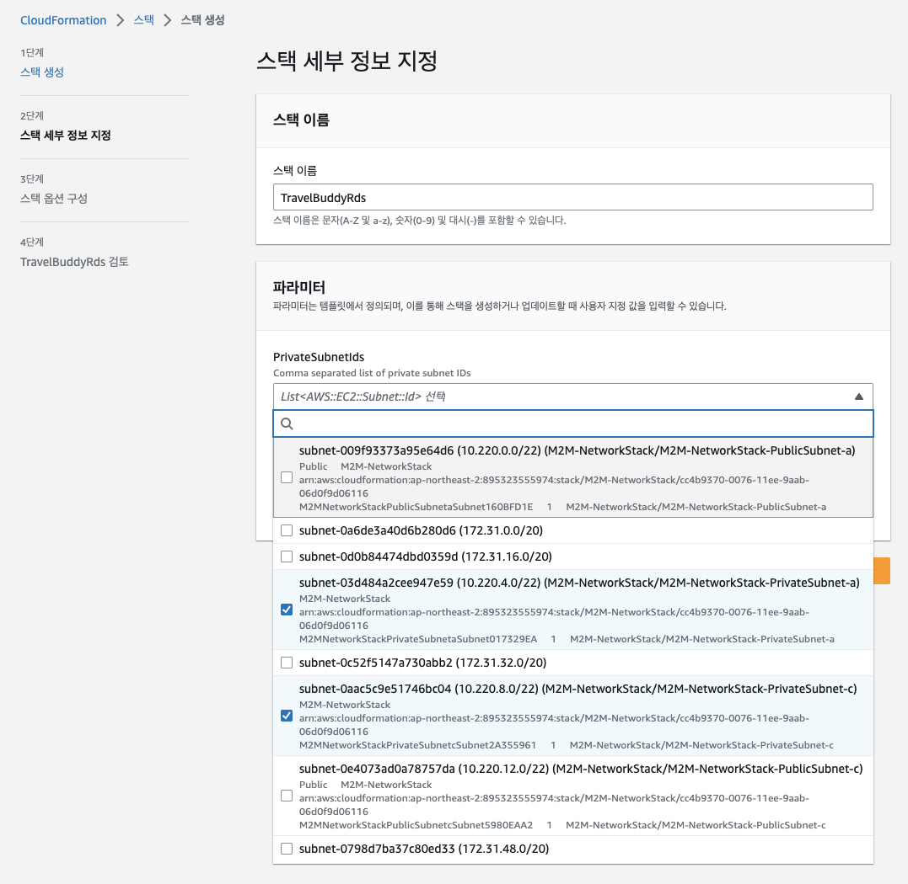
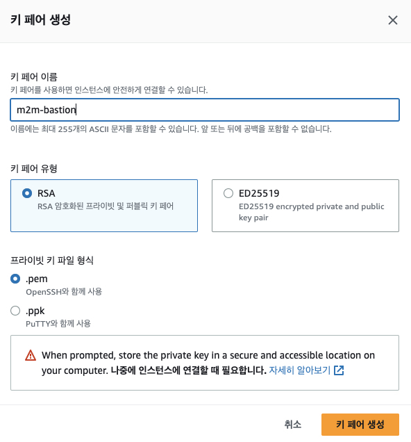
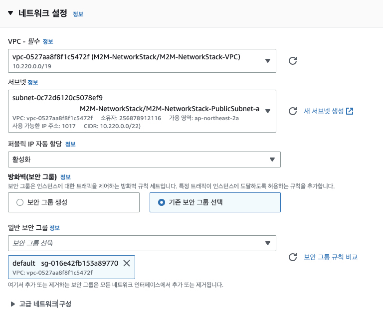
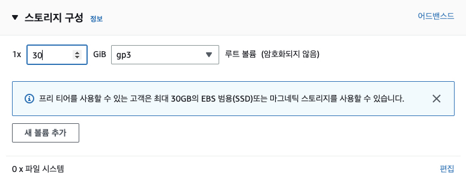
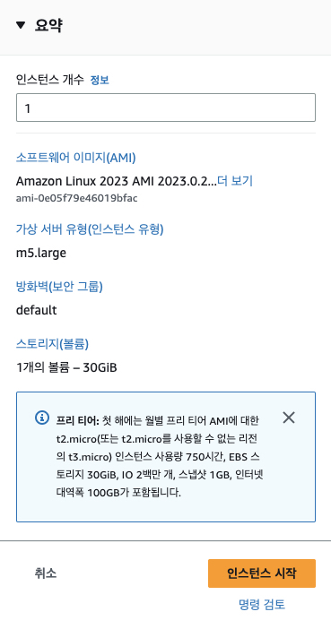
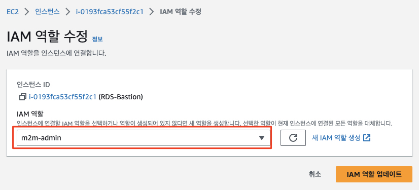
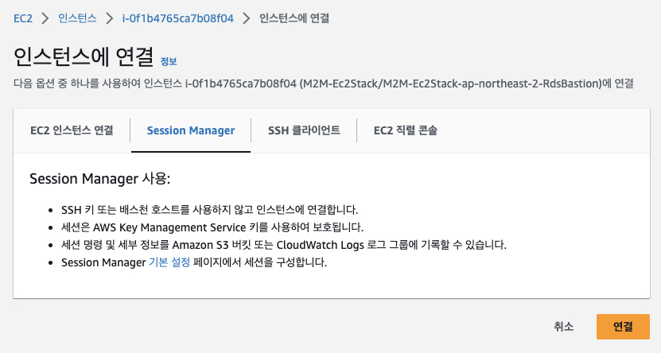
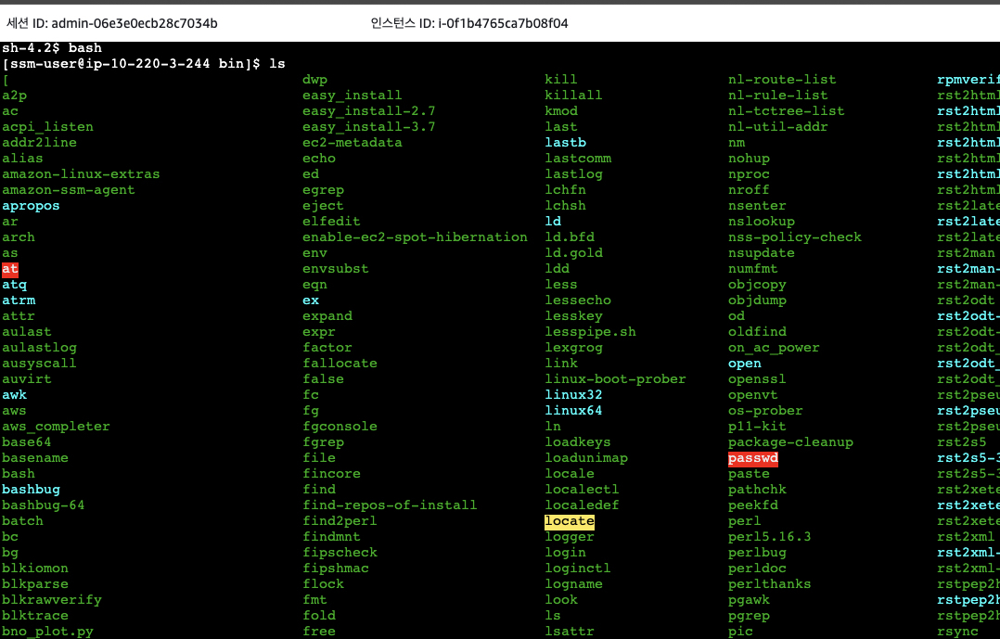
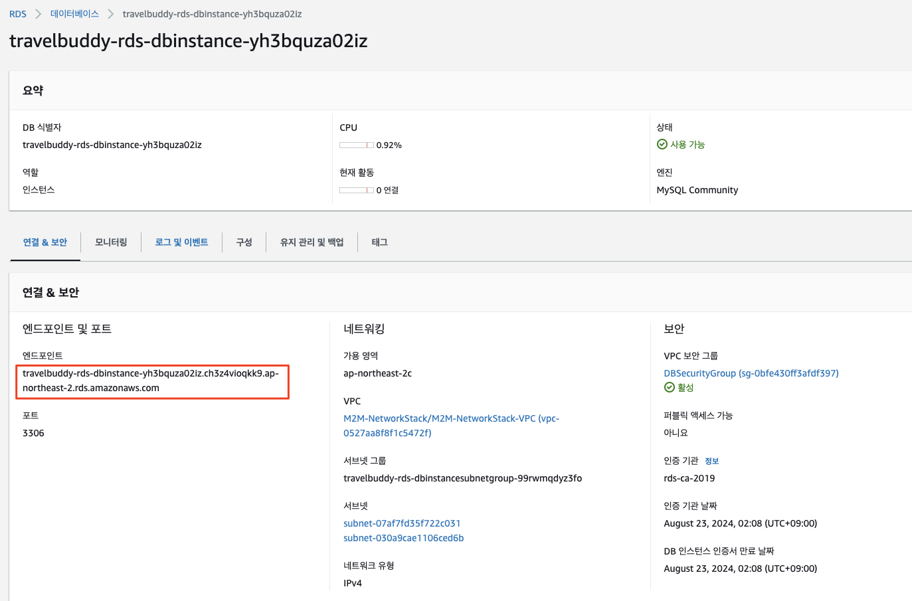
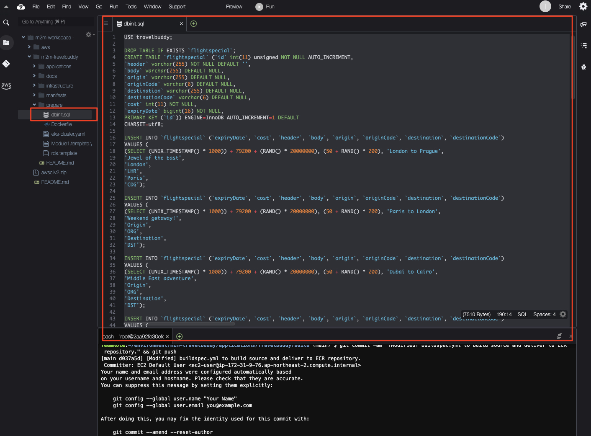

# Database Setup

## Agenda

1. RDS MySQL 인스턴스 생성
2. (옵션) Bastion Host 프로비저닝
3. (옵션) 인스턴스에 IAM Role 부여하기
4. MySQL 설정하기
    - Cloud9에서 Bastion 호스트에 접속
    - MySQL 클라이언트 설치하기
    - RDS 접속 및 데이터베이스 초기 구성

## 1. RDS MySQL 인스턴스 생성
RDS 인스턴스는 CloudFormation을 이용하여 배포합니다.

CloudFormation 콘솔로 이동하여 `Create stack` > `With new resources (standard)`를 클릭하여 Create stack 화면으로 진입합니다.

Prepare template는 `Template is ready`를 선택하고, Specify template에서 `Upload a template file`을 선택한 후, `Choose file` 버튼을 클릭하여 [prepare/rds.template](../prepare/rds.template) 파일을 업로드합니다.

Specify stack details 화면이 나타나면, Stack name으로 `TravelBuddyRds`를 입력하고, PrivateSubnetIds에는 EKS 클러스터의 private subnet 두 개를 선택합니다. VpcId에는 EKS 클러스터의 VpcId를 선택합니다.<br>


Next를 클릭해서 RDS를 생성합니다.

## 2. (옵션) Bastion Host 프로비저닝
<u>**(참고) 우리는 이미 CDK를 통해 Bastion Host와 이에 필요한 Security Group, EC2 Role 등을 생성하였으므로, 2, 3의 Bastion Host 프로비저닝 및 IAM Role 부여 단계는 이 자원들이 생성되지 않았을 경우에만 수행하여도 됩니다.**</u>

RDS에는 Public Access가 불가하기 때문에, RDS 설정을 위한 Bastion Host가 필요합니다.<br>
(사실 현재 사용하고 있는 Cloud9이 위치한 VPC와 Peering으로 연결하여 바로 접근 가능하지만, 그것보다는 연습삼아(?) Bastion Host를 따로 설정해 봅니다)

아래 그림과 같이 Bastion 호스트의 이름을 입력합니다. (eg. RDS-Bastion 혹은 간단하게 bastion)<br>


AMI는 `Amazon Linux 2023 AMI`를 선택합니다.<br>


인스턴스 타입은 `m5.large`을 선택합니다.<br>


실습에서는 `Create new key pair`를 클릭하여 새로운 키를 생성한 후 이를 사용합니다. 로컬에 다운로드된 Private Key 파일은 잘 보관합니다.<br>
(참고) 우리는 실습 환경에서 Putty나 SSH를 사용하기가 용이하지 않으므로, SSM Session Manager를 통해서 접속할 예정입니다. 하지만 만약을 위해 Private Key를 생성하고 다운받기로 합니다.<br>



네트워크 설정은 이전 단계에서 생성한 EKS 클러스터와 동일한 VPC를 선택하고, 서브넷으로는 Public 서브넷 중 하나를 선택합니다.<br>


스토리지는 컨테이너 빌드 등에 활용하기 위해서 30GB로 설정합니다.<br>


요약 내용을 확인한 후 `인스턴스 시작 (Launch instance)` 버튼을 클릭하여 인스턴스를 시작합니다.<br>


## 3. (옵션) 인스턴스에 IAM Role 부여하기

EC2 콘솔에서 위에서 생성한 bastion 호스트 인스턴스를 선택 후, ```작업 (Actions) > 보안 (Security) > IAM 역할 수정 (Modify IAM Role)```을 클릭합니다.<br>


IAM Role에서 ```m2m-admin```을 선택한 후, Save 버튼을 클릭합니다.<br>


## MySQL 설정하기

### SSM 세션 매니저로 Bastion 호스트에 접속
<br>
<br>
<br>

### MySQL 클라이언트 설치하기

```bash
sudo yum update -y
sudo yum -y install mysql
```

### RDS 접속 및 데이터베이스 초기 구성
아래에서 <rds_host> 부분은 CloudFormation으로 생성한 RDS의 접속 정보로 대체합니다.<br>

```bash
mysql -u root --password=labpassword -h <rds_host>
```
> (예)<br>
> mysql -u root --password=labpassword -h travelbuddy-rds-dbinstance-yh3bquza02iz.ch3z4vioqkk9.ap-northeast-2.rds.amazonaws.com

접속에 성공하면 다음 명령어로 travelbuddy 데이터베이스를 생성합니다.<br>
> ***(참고) 데이터베이스 형상 관리 도구 - Flyway***<br>
> https://flywaydb.org/documentation/command/migrate

[//]: # (> https://wildeveloperetrain.tistory.com/210)

```sql
-- Database 생성
CREATE DATABASE travelbuddy;

-- 확인
SHOW DATABASES;
```

Database를 생성한 후 [prepare/dbinit.sql](../prepare/dbinit.sql) 내용을 실행하여 database를 초기화합니다. SQL을 성공적으로 실행한 후 다음과 같이 확인합니다.<br>
Cloud9에서 해당 파일을 열어 클립보드로 복사한 후에 Bastion 호스트에 붙여 넣으면 쉽습니다.<br>

(참고) 붙여 넣으면 개행 문자를 중간에 포함한 구문은 모두 자동 실행되지만 가장 마지막 명령은 직접 엔터를 쳐주셔야 실행이 됩니다.

초기 데이터를 적재한 후 아래와 같이 테이블을 조회해 봅니다.<br>

```sql
-- Hotel Special 테이블 확인
SELECT * FROM hotelspecial;

-- Flight Special 테이블 확인
SELECT * FROM flightspecial;
```


다음 명령어로 mysql client를 종료합니다.

```sql
quit;
```
